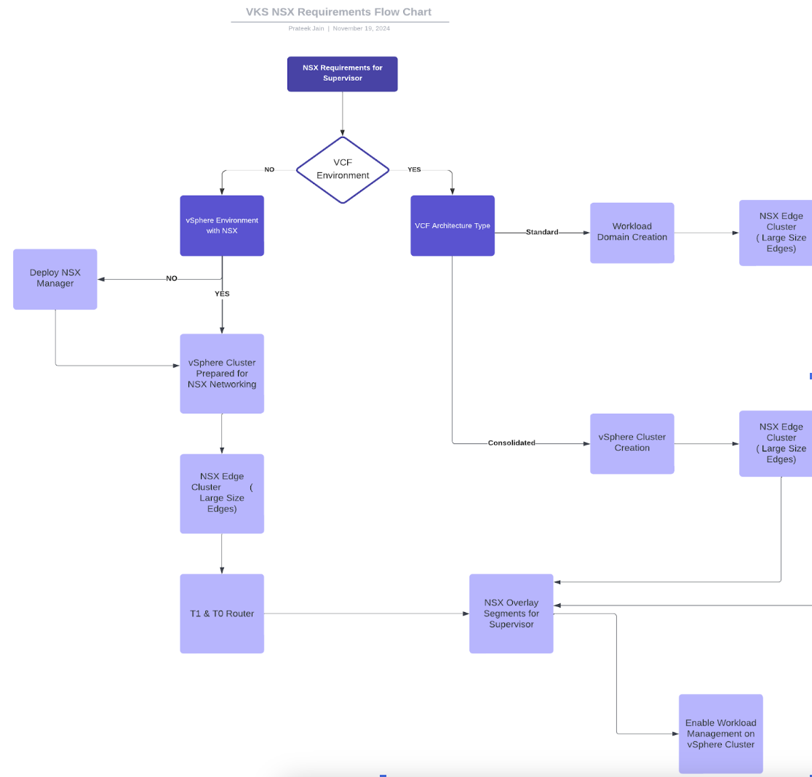
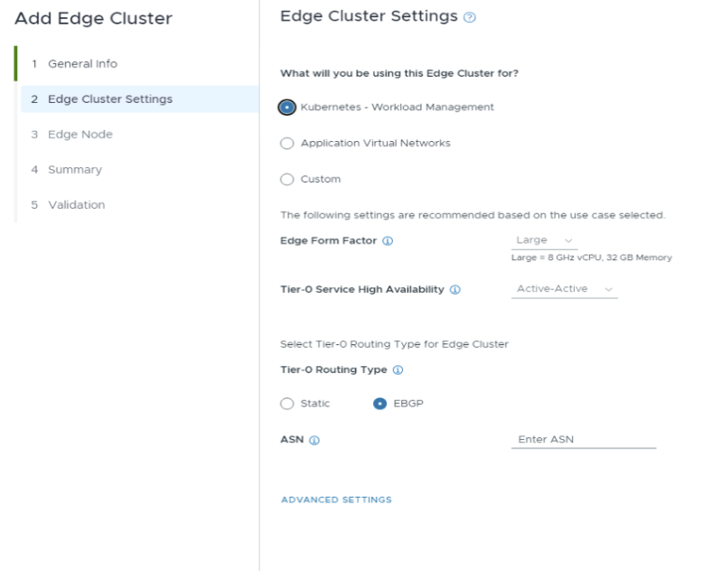

# Introduction

This document provides a comprehensive checklist and requirements for deploying NSX for Supervisors in a vSphere Environment. It covers the steps for both VCF and non-VCF Environments. The intended audience consists of the VI administrators, network administrators, and platform admins responsible for managing the platform and making the various services available for end users to consume.

## Standard checklist
* Make sure that all hostnames of all ESXi nodes servers are in lowercase.
* The minimum MTU required for the entire network path (VMkernel ports, virtual switches, physical switches, and routers) is 1600; however, the recommended value is 1700.  [Maximum Transmission Unit](https://techdocs.broadcom.com/us/en/vmware-cis/nsx/vmware-nsx/4-2/installation-guide/transport-zones-and-transport-nodes/mtu-guidance.html)



## NSX Configuration for VCF Environment 
This section outlines the VCF Environment process where SDDC Manager workflows do the NSX Configuration. 

### NSX Manager
VMware Cloud Foundation domains/clusters have NSX Managers deployed and are prepared for NSX by default. Sometimes, when the vSphere environment is converted to VCF via Brownfield Import/convert and does not have NSX installed, the converted environment would only have NSX-VLAN networking configured, not overlay.
Management Domain NSX Manager is deployed as medium-sized by default, which supports up to 128 hypervisors or five vSphere Clusters.  NSX Managers can be resized to Large or XL-Large based on the requirement. See [NSX Manager VM and Host Transport Node System Requirements](https://techdocs.broadcom.com/us/en/vmware-cis/nsx/vmware-nsx/4-2/installation-guide/preparing-for-installation/system-requirements/nsx-manager-and-host-transport-node-system-requirements.html).

Workload Domain NSX Managers should be deployed as Large or X-Large to support the supervisor in a scaled deployment environment. *Note* An SDDC Manager only supports 1000 Hosts, so a large or X-large NSX Manager should meet the requirements. 

| NSX Manager Size  | Supported Number of Hypervisors | Supported vSphere Clusters prepared for NSX |
| :---: | :---: | :---: |
| Medium Size | 128 | 5 |
| Large Size | 1250 | 256 |
| X-Large Size  | 1250 | 256 |

See [NSX Manager Configuration Maximums](https://configmax.broadcom.com/home)

- VCF deploys 3 NSX Managers by default for each domain (management and workload). 
- Management domain NSX cannot be shared with workload domains, but there is an option to share NSX Managers between Workload Domains. 
- VCF registers the Management domain vCenter Server as a compute manager in NSX, and a vSphere Cluster is prepared for NSX by creating a transport zone, uplink host switch profile, and transport node profile. 
- Creating VI Workload Domains follows the same methodology, and clusters are prepared for NSX Networking.

Note \-

* The Transport Zone would be the same across the Workload Domains sharing NSX Managers.  
* Additional clusters in VCF for a respective domain are added to the same transport zone.

### NSX Edge Transport Node 

The NSX Edge Transport Nodes provide key routing services and connectivity to networks outside the NSX deployment. NSX Edge Transport Nodes provide a pool of capacity for running centralized services and are required if you want to deploy a Tier-0 or Tier-1 router with stateful services such as network address translation (NAT), VPN, and so on.

The SDDC Manager provisions two NSX Edge Transport Nodes in an Edge Cluster. 

Pre-requisites for Edge-Cluster creation in VCF 
* Separate VLANs and Network Subnets for the NSX host overlay VLAN and NSX Edge overlay VLAN. No DHCP for the NSX Edge overlay VLAN  
* NSX host overlay VLAN and NSX Edge overlay VLAN need to be routed.  
* DNS record creation for NSX Edge Transport Node(s) Management IP   
* Management network and management network gateway for the NSX Edge Transport Node must be reachable from the NSX host overlay and NSX Edge overlay VLANs  
* The vSphere cluster hosting the NSX Edge nodes must include hosts with identical management, uplink, NSX Edge overlay TEP, and NSX Edge overlay TEP networks (L2 uniform).  
* The vSphere clusters hosting the NSX Edge node VMs must have the same pNIC speed for NSX-enabled VDS uplinks chosen for Edge overlay (e.g., either 10G or 25G but not both)  
* All nodes of an NSX Edge Transport Node Cluster must use the same set of NSX-enabled VDS uplinks. The selected uplinks must be prepared for overlay use.  
* For Dynamic Routing via BGP \- Setup two BGP peers (on TORs or infra ESG) with an interface IP, ASN, and BGP password and reserve a BGP ASN for the NSX Edge cluster’s Tier-0 interfaces.  
* For Routing via Static Routes \- Setup a Static Route via NSX Manager UI/API post creation of T0 Gateway 



Sample Edge Cluster JSON for creation of Large NSX Edge Cluster with EBGP Configuration

```json
{
   "edgeClusterName":"Edge-Cluster",
   "edgeClusterType":"NSX-T",
   "edgeRootPassword":"djwMIJ8AK1CFRDF",
   "edgeAdminPassword":"djwMIJ8AK1CFRDF",
   "edgeAuditPassword":"djwMIJ8AK1CFRDF",
   "edgeFormFactor":"LARGE",
   "tier0ServicesHighAvailability":"ACTIVE_ACTIVE",
   "mtu":9000,
   "asn":65003,
   "tier0RoutingType":"EBGP",
   "tier0Name":"T0_myCluster1",
   "tier1Name":"T1_myCluster1",
   "edgeClusterProfileType":"DEFAULT",
   "edgeNodeSpecs":[
      {
         "edgeNodeName":"nsxt-edge-node-1.env2.lab.test",
         "managementIP":"10.0.0.50/24",
         "managementGateway":"10.0.0.250",
         "edgeTepGateway":"192.168.52.1",
         "edgeTep1IP":"192.168.52.10/24",
         "edgeTep2IP":"192.168.52.11/24",
         "edgeTepVlan":"1252",
         "clusterId":"093ae2b2-670a-4f1e-8a0d-1bf5cfe59af1",
         "interRackCluster":"false",
         "uplinkNetwork":[
            {
               "uplinkVlan":2081,
               "uplinkInterfaceIP":"192.168.16.2/24",
               "peerIP":"192.168.16.10/24",
               "asnPeer":65001,
               "bgpPeerPassword":"password"
            },
            {
               "uplinkVlan":2082,
               "uplinkInterfaceIP":"192.168.17.2/24",
               "peerIP":"192.168.17.10/24",
               "asnPeer":65001,
               "bgpPeerPassword":"password"
            }
         ]
      },
      {
         "edgeNodeName":"nsxt-edge-node-2.env2.lab.test",
         "managementIP":"10.0.0.51/24",
         "managementGateway":"10.0.0.250",
         "edgeTepGateway":"192.168.53.1",
         "edgeTep1IP":"192.168.53.10/24",
         "edgeTep2IP":"192.168.53.11/24",
         "edgeTepVlan":"1253",
         "clusterId":"093ae2b2-670a-4f1e-8a0d-1bf5cfe59af1",
         "interRackCluster":"false",
         "uplinkNetwork":[
            {
               "uplinkVlan":2081,
               "uplinkInterfaceIP":"192.168.16.3/24",
               "peerIP":"192.168.16.10/24",
               "asnPeer":65001,
               "bgpPeerPassword":"password"
            },
            {
               "uplinkVlan":2082,
               "uplinkInterfaceIP":"192.168.17.3/24",
               "peerIP":"192.168.17.10/24",
               "asnPeer":65001,
               "bgpPeerPassword":"password"
            }
         ]
      }
   ]
}
```

### NSX T0 and T1 Router

VCF SDDC Manager automates the creation of T0 & T1 Gateway at the time of the edge cluster creation.
The T0 Gateway is deployed in Active-Active Mode HA Mode, and the T1 Gateway is deployed in Active-Standby HA Mode.

#### BGP Routing

The VCF configuration process automatically sets up the BGP routing. The EBGP configuration on the T0 Gateway advertises the segments to the TOR, and no additional configuration is required; however, to restrict IP advertisements and redistribution, the Route NSX IP Prefix list and Route Map can be configured on the T0 Gateway.

- NSX IP Prefix Document Reference \- [NSX IP Prefix List](https://techdocs.broadcom.com/us/en/vmware-cis/nsx/vmware-nsx/4-2/administration-guide/tier-0-gateways/create-an-nsx-ip-prefix-list.html)
- Route Map Document Reference \- [NSX Route Map](https://techdocs.broadcom.com/us/en/vmware-cis/nsx/vmware-nsx/4-2/administration-guide/tier-0-gateways/create-an-nsx-route-map.html)

#### Static Routing

The configuration for static routes has to be added after creating a T0 Gateway in NSX Manager by UI/API to route traffic to external networks. No additional configuration is required on T1 Gateways as the T1 Gateway has a default static route to the connected T0 Gateway. 
The static route's next hop IP address must exist in a subnet associated with one of the edge gateway uplink interfaces; otherwise, the static route configuration will fail.

NSX Static Routes Configuration Reference [Configure an NSX Static Route](https://techdocs.broadcom.com/us/en/vmware-cis/nsx/vmware-nsx/4-2/administration-guide/tier-0-gateways/configure-an-nsx-static-route.html).

## NSX Configuration for non-VCF Environment 

This section explicitly outlines the process for VCF/VVF/Standalone vSphere Environments **where SDDC Manager is not used for NSX Configuration**.

### NSX Manager 

- Install and Configure a 3 Node NSX Manager Cluster with a VIP as recommended for production environments. See [NSX Manager Install Guide](https://techdocs.broadcom.com/us/en/vmware-cis/nsx/vmware-nsx/4-2/installation-guide/nsx-transformers-installation-guide.html)
- NSX Managers should be deployed as **Large** or **X-Large** to ensure they can support the Supervisor in a scaled deployment environment. 
- For production deployment, 3 NSX Managers should be deployed.

| NSX Manager Size  | Supported Number of Hypervisors | Supported vSphere Clusters prepared for NSX |
| :---: | :---: | :---: |
| Medium Size | 128 | 5 |
| Large Size | 1250 | 256 |
| X-Large Size  | 1250 | 256 |

Reference \- [NSX Manager Configuration Maximums](https://configmax.broadcom.com/home)

### vSphere Cluster Preparation for NSX

The below steps have to be performed to prepare a vSphere Cluster for NSX 

* Creation of an Overlay Transport Zone and a VLAN Transport Zone   
* Creation of Uplink Host Profile for Host Uplinks and Edge Uplinks   
* Creation of Transport Node Profile   
* Attach the Transport Node Profile to the vSphere Cluster

Reference Documentation \- [NSX Host Transport Node](https://techdocs.broadcom.com/us/en/vmware-cis/nsx/vmware-nsx/4-2/installation-guide/host-transport-nodes.html)

**Note** \- The minimum MTU required for the entire network path (VMkernel ports, virtual switches, physical switches, and routers) is 1600; however, the recommended value is 1700\. 

Reference Documentation \- [Maximum Transmission Unit](https://techdocs.broadcom.com/us/en/vmware-cis/nsx/vmware-nsx/4-2/installation-guide/transport-zones-and-transport-nodes/mtu-guidance.html)

Verify Host TEP-TEP Connectivity via the example below -

```
# Execute this on the ESXI node to check for valid communication
$ vmkping -I vmk10 -S vxlan <destination_host's_TEP_VMK_IP> -d -s 1572
```

### NSX Edge Transport Node 

* Create 2 Large Edge Transport Node directly from NSX UI/API/CLI 

Pre-requisites for NSX Edge Transport Creation
* Separate VLANs and Network Subnets are available for the NSX host overlay VLAN and NSX Edge overlay VLAN. No DHCP for the NSX Edge overlay VLAN  
* NSX host overlay VLAN and NSX Edge overlay VLAN need to be routed.  
* DNS record creation for NSX Edges Nodes Management IP   
* Management network and management network gateway for the NSX Edge nodes must be reachable from the NSX host overlay and NSX Edge overlay VLANs  
* The vSphere clusters hosting the Edge clusters should be L2 Uniform. All host nodes in a hosting vSphere cluster need identical management, uplink, Edge, and host TEP networks.  
* The vSphere clusters hosting the NSX Edge node VMs must have the same pNIC speed for NSX-enabled VDS uplinks chosen for Edge overlay (e.g., either 10G or 25G but not both)  
* All nodes of an NSX Edge cluster must use the same set of NSX-enabled VDS uplinks. The selected uplinks must be prepared for overlay use.  
* For Dynamic Routing via BGP \- Setup two BGP peers (on TORs or infra ESG) with an interface IP, ASN, and BGP password and reserve a BGP ASN for the NSX Edge cluster’s Tier-0 interfaces.  
* For Routing via Static Routes \- Setup a Static Route via NSX Manager UI/API post creation of T0 Gateway 

Post successful creation of two 2 Edge Transport, create an Edge Cluster and add the NSX Edge Transport Node to the Edge Cluster.

- Documentation Reference \- [Create NSX Edge](https://techdocs.broadcom.com/us/en/vmware-cis/nsx/vmware-nsx/4-2/installation-guide/installing-nsx-edge.html) 
- Documentation Reference \- [Create NSX Edge Cluster](https://techdocs.broadcom.com/us/en/vmware-cis/nsx/vmware-nsx/4-2/installation-guide/installing-nsx-edge/create-an-edge-cluster.html)

### NSX T0 Router

Create a T0 Gateway by selecting the Edge Cluster and creating external interfaces. Reference Documentation \- [Create T0 Gateway](https://techdocs.broadcom.com/us/en/vmware-cis/nsx/vmware-nsx/4-2/administration-guide/tier-0-gateways/add-an-nsx-tier-0-gateway.html) 

#### BGP Routing
The VCF configuration process automatically sets up the BGP routing. The EBGP configuration on the T0 Gateway advertises the segments to the TOR, and no additional configuration is required; however, to restrict IP advertisements and redistribution, the Route NSX IP Prefix list and Route Map can be configured on the T0 Gateway.

NSX IP Prefix Document Reference \- [NSX IP Prefix List](https://techdocs.broadcom.com/us/en/vmware-cis/nsx/vmware-nsx/4-2/administration-guide/tier-0-gateways/create-an-nsx-ip-prefix-list.html)

Route Map Document Reference \- [NSX Route Map](https://techdocs.broadcom.com/us/en/vmware-cis/nsx/vmware-nsx/4-2/administration-guide/tier-0-gateways/create-an-nsx-route-map.html)

#### Static Routing
The configuration for static routes has to be added after creating a T0 Gateway in NSX Manager by UI/API to route traffic to external networks. No additional configuration is required on T1 Gateways as the T1 Gateway has a default static route to the connected T0 Gateway. The static route's next hop IP address must exist in a subnet associated with one of the edge gateway uplink interfaces; otherwise, the static route configuration will fail.

NSX Static Routes Configuration Documentation Reference [Configure an NSX Static Route](https://techdocs.broadcom.com/us/en/vmware-cis/nsx/vmware-nsx/4-2/administration-guide/tier-0-gateways/configure-an-nsx-static-route.html).

## Supervisor Networking Requirements 

This section outlines the network requirements for the Supervisor network, a common step for VCF and vSphere Environments. 

* The Supervisor requires **two** routed network CIDRs for egress and ingress networks.

**Ingress Network** \- Routed IP Segment with a non-overlapping CIDR range to be used for IP addresses of ingress. Ingress IP CIDR Block allocates IP addresses for published services with service type LoadBalancer or Ingress controller resource that handles external traffic to services. The minimum requirement is a CIDR of /27.

**Egress Network** \- Routed IP Segment with a non-overlapping CIDR range to determine the egress IP for Kubernetes services and namespaces . The egress IP is used to initiate outbound traffic to outbound services. The minimum requirement is a CIDR of /27.

**IMPORTANT** \- 

For a **Static Route** configuration, add a static route on TOR with NSX T0 Uplink Interface as the next hop for both Ingress Network and Egress Network. 

```
# sample router statement could be similar to this
ip route add <INGRESS NETWORK RANGE> -mask <NETMASK> -gw <T0 UPLINK INTERFACE IP>
ip route add <EGRESS NETWORK RANGE>  -mask <NETMASK> -gw <T0 UPLINK INTERFACE IP>
```

For a **BGP-based** configuration, the dynamic routing protocol automatically advertises the segments to the TOR, removing the need for additional configuration.

**Other Network Requirements**

**Management Network**—This subnet manages traffic between ESXi hosts, vCenter Server, NSX Appliances, and the Kubernetes control plane. It should have a minimum of five IP addresses for the Kubernetes control plane ( Supervisor Nodes): one for each of the three nodes, one for virtual IP, and one for rolling cluster upgrade. The Management network segment can be on the Overlay or vDS-backed and should be routed. 

**Kubernetes Service CIDR**—A non-routed Private/Internal CIDR block from which IPs for Kubernetes ClusterIP Services will be allocated. It cannot overlap with IPs of Workload Management components (VC, NSX, ESXs, Management DNS, NTP) and should not overlap with other data center IPs communicating with pods. This can be changed or left at default at the deployment time; however, each Supervisor cluster must have a unique service CIDR.

At this time, the NSX Environment is ready to deploy Supervisor Nodes.